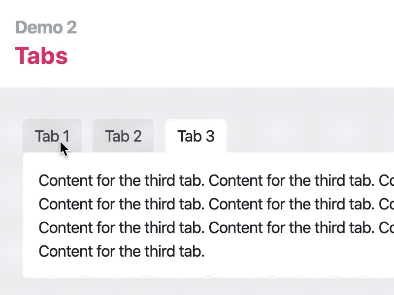
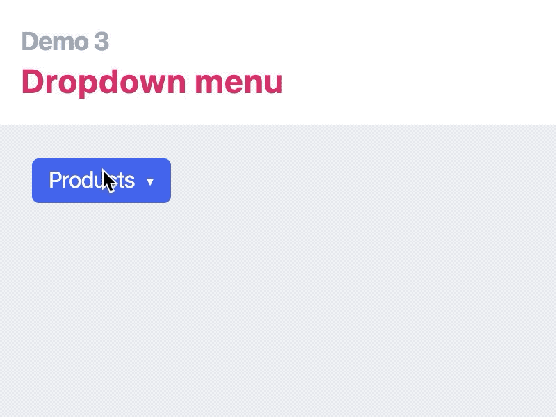

# Classmatic


A small library for toggling menus, dropdowns, and tabs.

> Just enough JS for simple websites.

## How it works


## Install

Add this to your `<head>`:

```html
<script src="https://cdn.jsdelivr.net/gh/panphora/classmatic@v0.6.1/dist/classmatic.min.js" defer></script>
```

Or `npm install classmatic`.

## Examples

#### Sidebar


```html
<div data-show-if=".sidebar-open">
  <button data-click-to-remove-class="sidebar-open">close</button>
  <h3>Menu</h3>
  <ul>
    <li>Home</li>
    <li>Features</li>
    <li>About</li>
    <li>Contact Us</li>
  </ul>
</div>
<button data-click-to-toggle-class="sidebar-open">Toggle sidebar</button>
```

*Demo:* [Sidebar on Codepen](https://codepen.io/panphora/pen/ZEYRbbE?editors=1000)

#### Tabs



```html
<button 
  data-click-to-add-class="tab-1-active" 
  data-click-to-remove-class="[tab-2-active,tab-3-active]"
>Tab 1</button>
<button 
  data-click-to-add-class="tab-2-active" 
  data-click-to-remove-class="[tab-1-active,tab-3-active]"
>Tab 2</button>
<button 
  data-click-to-add-class="tab-3-active" 
  data-click-to-remove-class="[tab-1-active,tab-2-active]"
>Tab 3</button>
<div data-show-if=".tab-1-active">First tab content.</div>
<div data-show-if=".tab-2-active">Second tab content.</div>
<div data-show-if=".tab-3-active">Third tab content.</div>
```

*Demo:* [Tabs on Codepen](https://codepen.io/panphora/pen/RwNJWWx?editors=1000)

#### Dropdown Menu



```html
<button data-click-to-toggle-class="dropdown-open">Products</button>
<ul data-click-away-to-remove-class="dropdown-open" data-show-if=".dropdown-open">
  <li>Access Connect</li>
  <li>Acquire Connect</li>
  <li>Prospect Connect</li>
  <li>Data Connect</li>
</ul>
```

*Demo:* [Dropdown Menu on Codepen](https://codepen.io/panphora/pen/GRgGpZx?editors=1000)

## Code

* `data-click-to-add-class="className selector(optional)"`
  * When element is clicked, add `className` to `selector`
* `data-click-to-remove-class="className selector(optional)"`
  * When element is clicked, remove `className` from `selector`
* `data-click-to-toggle-class="className selector(optional)"`
  * When element is clicked, toggle `className` on `selector`
* `data-click-away-to-add-class="className selector(optional)"`
  * When element is **not** clicked, add `className` to `selector`
* `data-click-away-to-remove-class="className selector(optional)"`
  * When element is **not** clicked, remove `className` from `selector`
* `data-click-away-to-toggle-class="className selector(optional)"`
  * When element is **not** clicked, toggle `className` on `selector`
* `data-show-if="selector"`
  * Show element if ancestor matches `selector`
* `data-hide-if="selector"`
  * Hides element if ancestor matches `selector`

**Notes** 

* `selector` defaults to `body` for the "click" attributes
* Target multiple classes: `[className1,className2]` (no spaces!)
* A **click away** action won't trigger if there's a normal click action with the same targets


